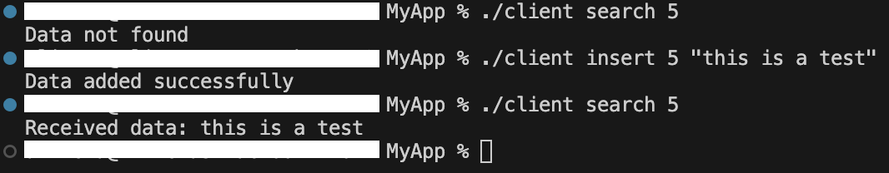
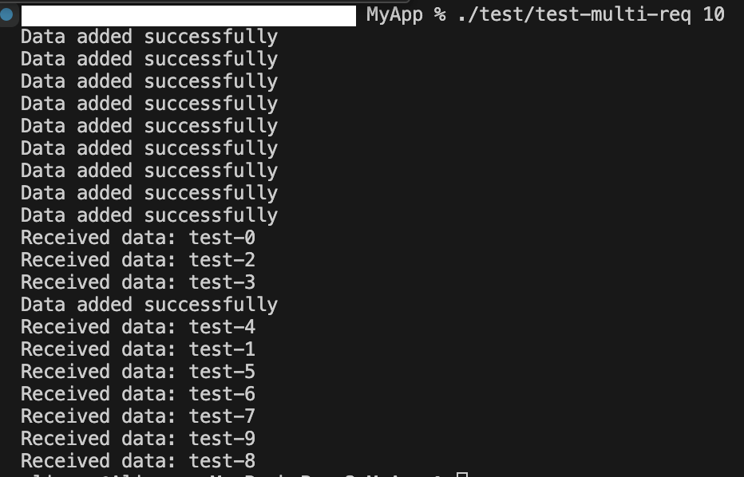
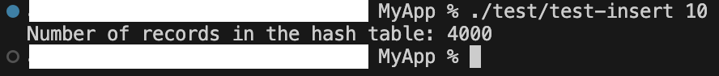
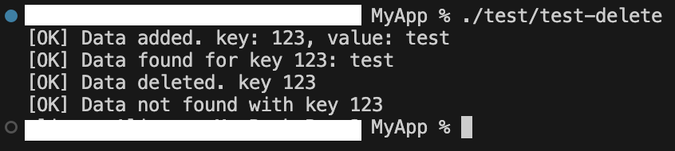
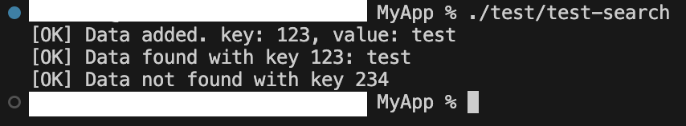

## Step 1: Download the Source Code

Clone the LMDB repository from GitHub by running the following command:

```bash
git clone https://github.com/AlirezaMlek/hash-map-app.git
```

## Compile Application

Navigate to the Application directory and compile it:

```bash
make
```

## How does it work?

This application contains a server and a client. The client can add, remove, or search data in a hash map on the server side with POSIX shared memory.

### Data type:

Each record is an entity and is stored in a hash map. The client sends requests to the server by adding them to the shared memory. Each request can perform one of the transactions: insert, delete, or search. On the other hand, the server performs the operations and sends the responses within the shared memory.

Run these commands to perform insert, delete, and search operations:

```bash
./server # start server
./client insert <key> "<value>" # insert string data with key <key> --- example: ./client insert 5 "this is a test"
./client delete <key> # delete record
./client search <key> # search record
```



### Test:

You can check the application performance:

* ### Client adds multiple records concurrently and searches them concurrently:

```bash
./test-client-send-multi <number of records>
```




* ### HashMap:

1. Test insert: add 1000 records to each bucket

```bash
./test/test-insert <number of buckets>
```



2. Test delete: add a record and delete it

```bash
./test/test-delete
```




3. Test search: add a record and search it

```bash
./test/test-search
```



## Scalability:

<b>Concurrency</b>: The ability of the server and client to handle multiple requests simultaneously without significant performance degradation.

<b>Resource Utilization</b>: The server can add records in parallel in the buckets and serially in each bucket.

Also, we can optimize the hash table by making it resizable and using data sharding.
